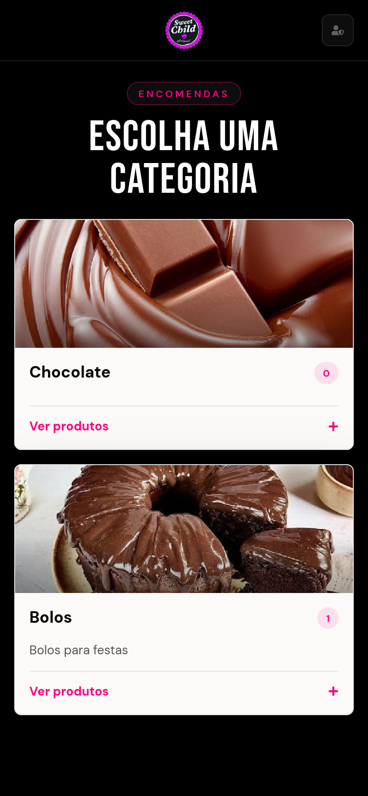
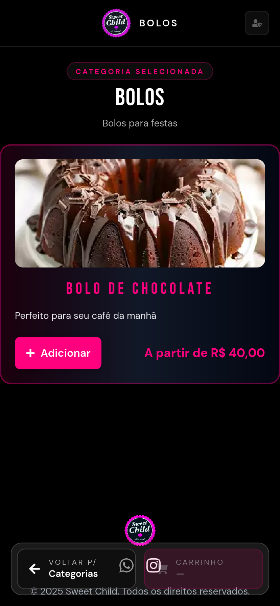
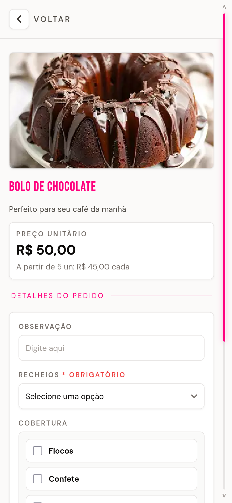
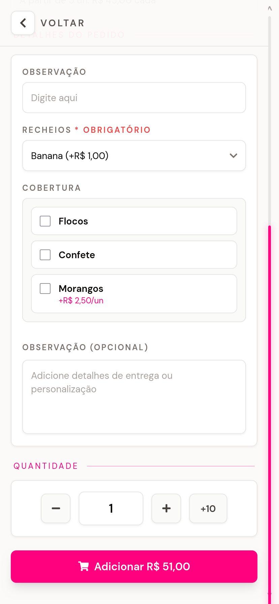
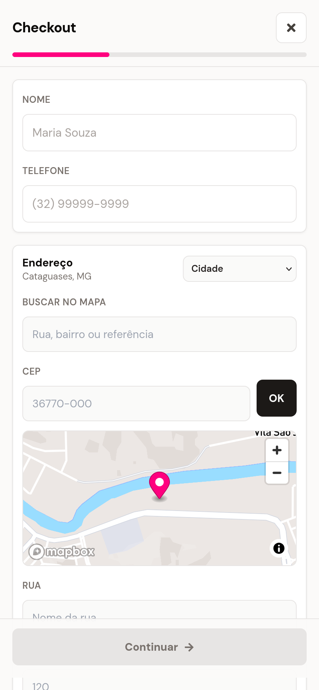
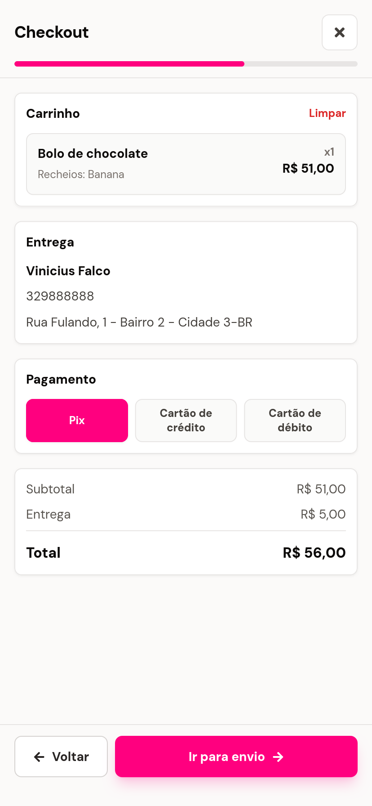
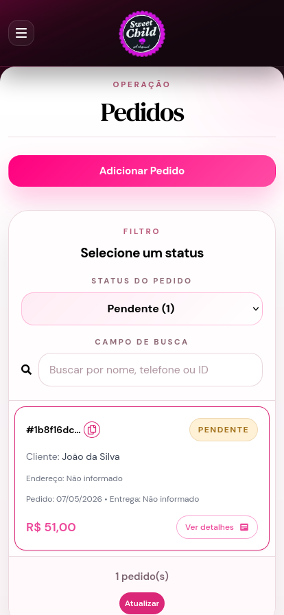
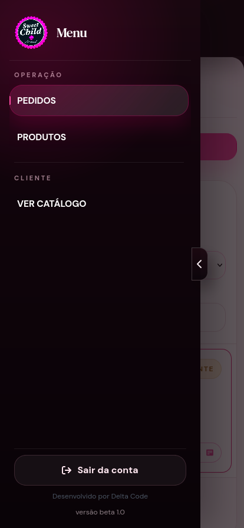
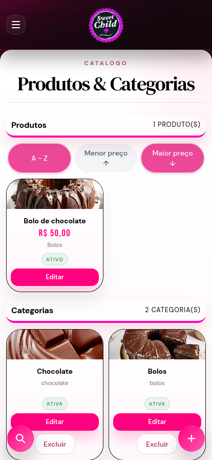

# 🍰 Palha Italiana Website | Sweet Child

Sistema web desenvolvido para a **Sweet Child**, uma confeitaria artesanal especializada em palhas italianas, doces personalizados e encomendas para eventos.

O projeto funciona como um **catálogo digital com fluxo de pedidos**, permitindo que clientes visualizem produtos, adicionem itens ao carrinho, preencham seus dados e enviem o pedido diretamente pelo WhatsApp.

Além da área pública para clientes, o sistema também conta com estrutura de **painel administrativo**, pensado para facilitar a gestão de produtos, categorias, pedidos e informações comerciais.

## 📱 Preview do projeto

Uma visão geral das principais telas do sistema, incluindo a experiência do cliente, fluxo de checkout e painel administrativo.

---

### 🛍️ Experiência do cliente

  
  
  

  <b>Catálogo por categorias</b> •
  <b>Listagem de produtos</b> •
  <b>Seleção e personalização do produto</b>

---

### 🧾 Fluxo de checkout

  
  
  

  <b>Detalhes do pedido</b> •
  <b>Preenchimento de entrega</b> •
  <b>Resumo final e envio</b>

---

### ⚙️ Painel administrativo

  
  
  

  <b>Gestão de pedidos</b> •
  <b>Navegação do painel</b> •
  <b>Produtos e categorias</b>

---

## 🔗 Deploy

Acesse o projeto online:

[https://palha-italiana-website.vercel.app](https://palha-italiana-website.vercel.app)

---

## 📌 Sobre o projeto

Este projeto foi desenvolvido com foco em pequenos negócios que precisam vender de forma simples, rápida e organizada, sem depender inicialmente de uma plataforma complexa de e-commerce.

A proposta foi criar uma experiência parecida com um cardápio digital, mas com recursos mais completos, como:

- catálogo de produtos por categoria;
- carrinho de compras;
- checkout com dados do cliente;
- validação de endereço;
- envio estruturado do pedido pelo WhatsApp;
- painel administrativo;
- integração com banco de dados;
- layout responsivo para celular, tablet e desktop.

---

## 🚀 Funcionalidades

### Área do cliente

- Visualização de categorias ativas
- Listagem de produtos por categoria
- Modal com detalhes do produto
- Seleção de quantidade
- Personalizações de produtos, quando disponíveis
- Carrinho de compras
- Checkout com nome, telefone e endereço
- Validação de área de entrega
- Escolha da forma de pagamento
- Resumo do pedido antes da confirmação
- Envio automático do pedido para o WhatsApp da empresa

### Painel administrativo

- Área administrativa para gestão interna
- Estrutura para cadastro e edição de produtos
- Organização de categorias
- Acompanhamento de pedidos
- Componentes reutilizáveis para dashboard
- Métricas visuais no cabeçalho administrativo
- Layout desktop-first para melhor uso em gestão

### Recursos técnicos

- Integração com Supabase
- Consumo de dados públicos via API REST
- Geração de UUID no frontend
- Tratamento de erros em requisições
- Organização modular de componentes
- Separação entre área pública e área administrativa
- Build otimizado com Vite
- Responsividade mobile-first na área do cliente

---

## 🛠️ Tecnologias utilizadas

- **React**
- **TypeScript**
- **Vite**
- **Tailwind CSS**
- **React Router**
- **Supabase**
- **Supabase CLI**
- **Mapbox**
- **React Icons**
- **jsPDF**
- **Vercel**

---

## 📁 Estrutura do projeto

~~~bash
src/
├── components/
│   ├── admin/              # Componentes do painel administrativo
│   ├── checkout/           # Componentes ligados ao fluxo de pedido
│   ├── layout/             # Componentes estruturais
│   └── ui/                 # Componentes reutilizáveis
│
├── pages/
│   ├── admin/              # Páginas administrativas
│   ├── HomePage.tsx        # Página inicial
│   └── OrderPage.tsx       # Página de pedidos
│
├── lib/                    # Configurações e integrações externas
├── hooks/                  # Hooks personalizados
├── styles/                 # Estilos globais e do sistema
├── types/                  # Tipagens TypeScript
└── assets/                 # Imagens, fontes e arquivos estáticos
~~~

---

## 🎨 Design e experiência

A interface foi pensada para transmitir uma identidade visual marcante, combinando tons escuros com rosa vibrante, remetendo ao universo da confeitaria artesanal de forma moderna e chamativa.

O projeto possui duas abordagens de responsividade:

- **Área do cliente:** mobile-first, priorizando a experiência de compra pelo celular.
- **Painel administrativo:** desktop-first, priorizando organização, leitura de dados e produtividade.

---

## 📲 Fluxo de pedido

O fluxo principal do sistema funciona da seguinte forma:

~~~txt
Cliente acessa o catálogo
↓
Escolhe uma categoria
↓
Seleciona os produtos
↓
Adiciona ao carrinho
↓
Preenche dados de entrega
↓
Revisa o pedido
↓
Confirma
↓
Sistema salva o pedido no Supabase
↓
Pedido é enviado automaticamente para o WhatsApp da empresa
~~~

---

## 🧠 Aprendizados do projeto

Durante o desenvolvimento deste projeto, foram trabalhados pontos importantes de uma aplicação web real, como:

- organização de arquitetura frontend;
- integração com banco de dados externo;
- criação de fluxo de compra;
- construção de painel administrativo;
- tratamento de estados e erros;
- responsividade para diferentes dispositivos;
- separação entre experiência do cliente e gestão interna;
- deploy de aplicação frontend;
- uso de TypeScript em componentes e integrações.

---

## 📌 Melhorias futuras

- Finalizar todos os módulos do painel administrativo
- Implementar relatórios de vendas
- Adicionar autenticação mais completa para administradores
- Criar sistema de cupons avançado
- Melhorar filtros de pedidos
- Implementar notificações internas
- Adicionar testes automatizados
- Melhorar acessibilidade
- Transformar o catálogo em PWA
- Adicionar dashboard financeiro

---

## 📄 Observação

Este projeto foi desenvolvido para fins comerciais e também é apresentado como demonstração técnica de desenvolvimento frontend, integração com banco de dados e criação de sistemas web para pequenos negócios.

O uso da marca, identidade visual, imagens e dados comerciais pertence à Sweet Child.

---

## 👨‍💻 Desenvolvedor

Desenvolvido por **Vinicius Falco**.

[GitHub](https://github.com/ViniciusFalco)
